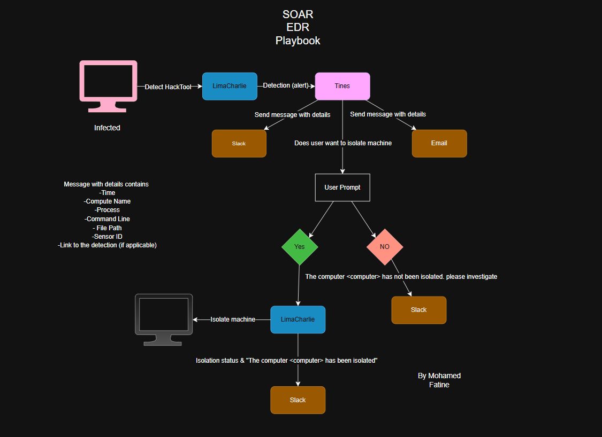
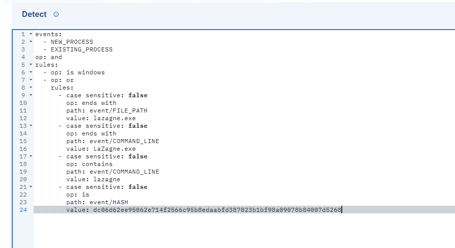
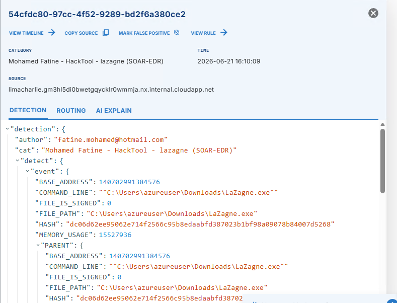
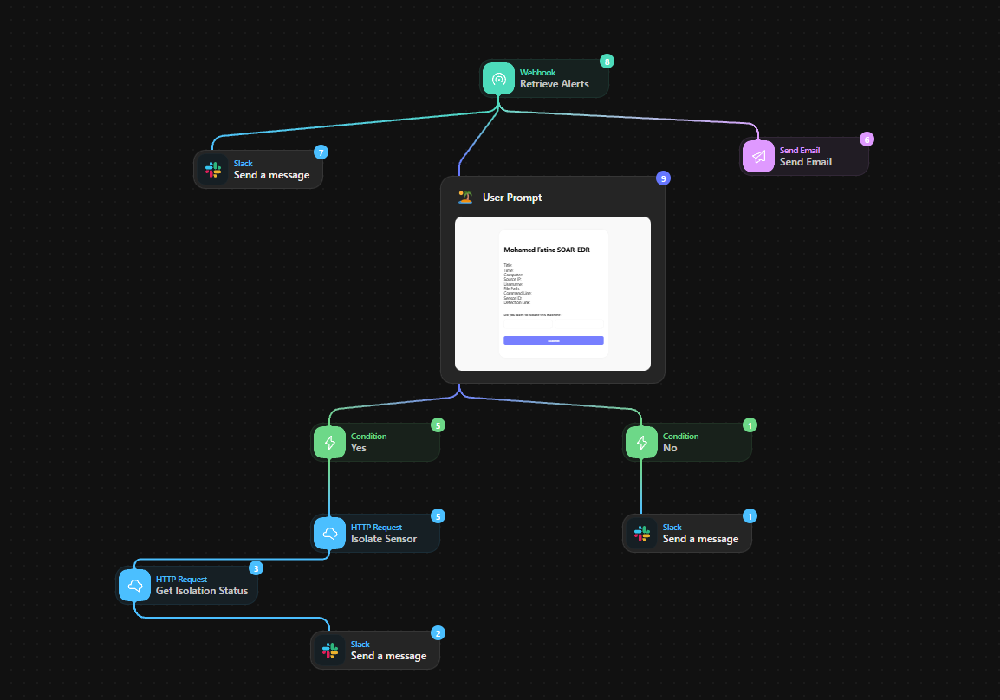
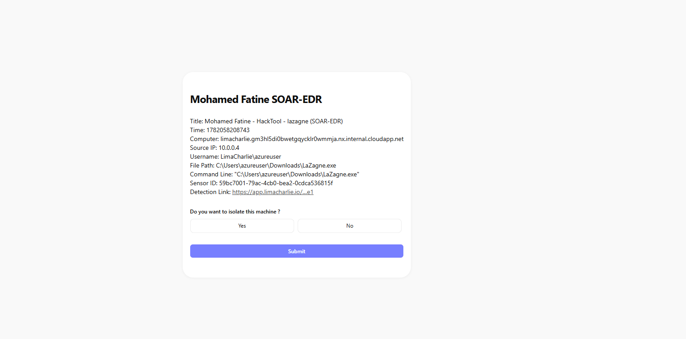
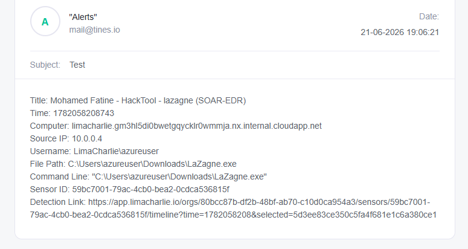
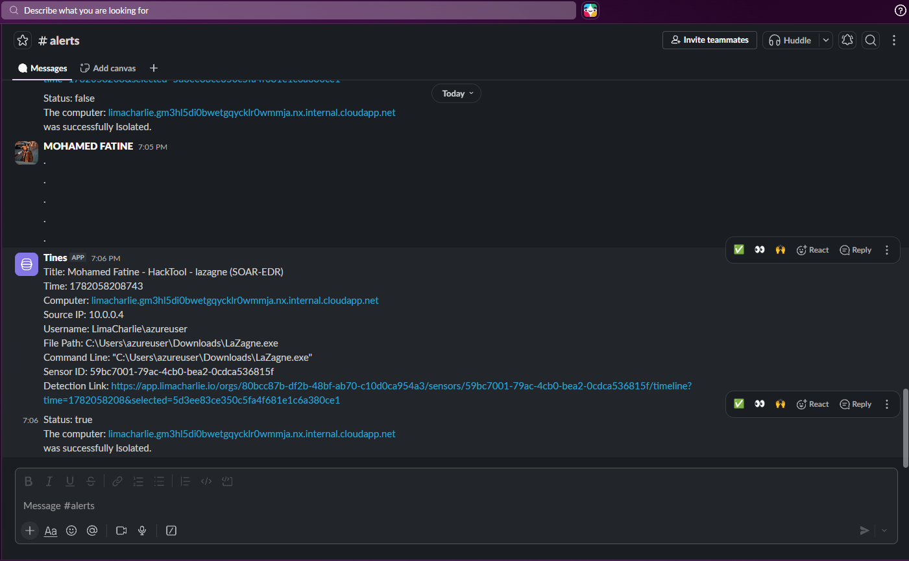
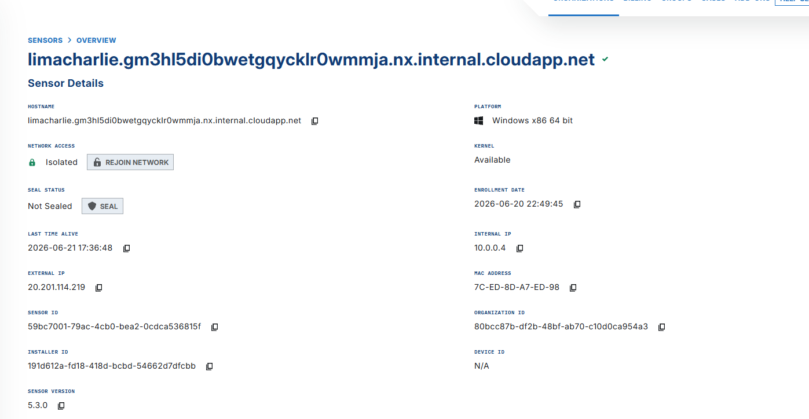
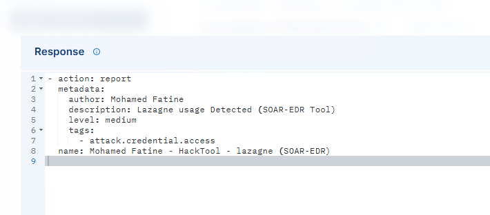

# Automated Incident Response Lab using LimaCharlie EDR, Tines SOAR, Slack and Endpoint Isolation

## Overview

This project demonstrates an automated incident response workflow that integrates **Microsoft Azure**, **LimaCharlie EDR**, **Tines SOAR**, **Slack**, and **Email Notifications** to detect, investigate, and contain malicious activity.

A Windows Server virtual machine was deployed in Microsoft Azure and onboarded to LimaCharlie EDR for monitoring. A custom LimaCharlie Detection & Response (D&R) rule was developed to identify the execution of **LaZagne**, a credential dumping and password recovery tool commonly associated with the **Credential Access** tactic in the MITRE ATT&CK framework.

When a detection occurs, LimaCharlie forwards the alert to Tines, which automatically notifies analysts through Slack and Email, presents an analyst approval prompt, and optionally isolates the affected endpoint through the LimaCharlie API.

---

## Architecture

---

## Environment

The lab environment was deployed in Microsoft Azure to simulate a real-world cloud-hosted endpoint monitoring and incident response scenario.

### Infrastructure

* Microsoft Azure Virtual Machine
* Windows Server Endpoint
* LimaCharlie EDR Sensor
* Tines SOAR Platform
* Slack Workspace
* Email Notification Service

The Azure-hosted endpoint was monitored by LimaCharlie and used to simulate credential access activity through LaZagne execution.

---

## Technologies Used

* Microsoft Azure
* Windows Server
* LimaCharlie EDR
* Tines SOAR
* Slack
* Email Notifications
* HTTP API Integrations
* Detection & Response Rules
* Endpoint Isolation

---

## Project Workflow

1. LaZagne is executed on the Azure-hosted Windows Server endpoint.
2. LimaCharlie detects the activity using a custom D&R rule.
3. A detection alert is generated.
4. The alert is sent to Tines through a webhook.
5. Tines sends:

   * Slack Notification
   * Email Notification
6. Tines presents an analyst approval prompt.
7. The analyst chooses whether to isolate the endpoint.
8. If approved:

   * LimaCharlie isolates the endpoint.
   * Isolation status is verified.
   * Slack confirmation is sent.
9. If denied:

   * Slack notification requests further investigation.

---

## Detection Rule

The following custom D&R rule was created to detect LaZagne execution through process path, command-line activity, and file hash matching.

---

## Detection Alert

LimaCharlie successfully detected the execution of LaZagne and generated an alert.

---

## Tines SOAR Playbook

The playbook orchestrates alert retrieval, notifications, analyst approval, endpoint isolation, and status verification.

---

## Analyst Approval

Before containment actions are executed, analysts are prompted to approve or deny endpoint isolation.

---

## Email Notification

Automated email notifications provide analysts with detailed alert information including hostname, username, file path, command line, sensor ID, and detection link.

---

## Slack Notifications

Alert details and containment status are automatically sent to Slack.

---

## Endpoint Isolation

Upon analyst approval, Tines calls the LimaCharlie API to isolate the affected endpoint.

---

## Response Action

The LimaCharlie response action performs network isolation to contain the potentially compromised endpoint.

---

## Testing and Validation

### Attack Simulation

* Deployed a Windows Server virtual machine in Microsoft Azure.
* Installed and configured the LimaCharlie EDR sensor.
* Executed the LaZagne password recovery tool.
* Custom D&R rule detected the activity.
* Alert was forwarded to Tines via webhook.
* Slack notification was generated.
* Email notification was generated.
* Analyst approval prompt was displayed.
* Endpoint isolation was approved.
* LimaCharlie successfully isolated the endpoint.
* Isolation status was retrieved and reported back to Slack.

### Validation Result

The workflow successfully demonstrated:

* Detection
* Alerting
* Notification
* Analyst Decision Making
* Automated Containment
* Containment Verification

During testing, analyst-approved endpoint isolation successfully isolated the Azure-hosted Windows Server from the network, immediately terminating active Remote Desktop (RDP) connectivity and validating successful containment.

---

## MITRE ATT&CK Mapping

| Tactic            | Technique                     |
| ----------------- | ----------------------------- |
| Credential Access | T1003 – OS Credential Dumping |

---

## Key Skills Demonstrated

* Endpoint Detection & Response (EDR)
* Security Orchestration, Automation and Response (SOAR)
* Detection Engineering
* Incident Response
* Threat Detection
* Security Automation
* API Integrations
* Cloud Security Monitoring
* Microsoft Azure Administration
* Slack Automation
* Endpoint Containment
* Analyst Approval Workflows

---

## Project Outcomes

* Built an Azure-hosted incident response lab.
* Developed custom LimaCharlie detection logic for credential-access activity.
* Integrated LimaCharlie with Tines using webhooks and API calls.
* Automated analyst notifications through Slack and Email.
* Implemented analyst-driven containment decisions.
* Executed successful endpoint isolation and containment verification.
* Simulated a real-world SOC incident response workflow from detection to remediation.

---

## Author

**Mohamed Fatine**

Cybersecurity Enthusiast focused on SOC Operations, Detection Engineering, Incident Response, SOAR Automation, Cloud Security, and Purple Teaming.
